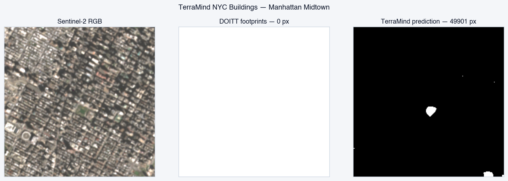
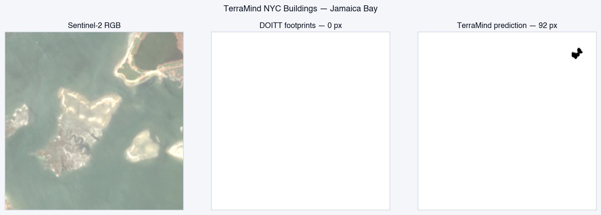
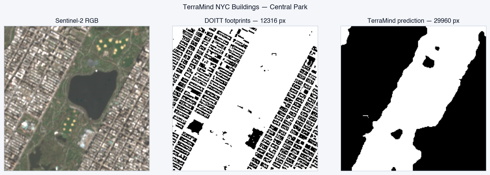
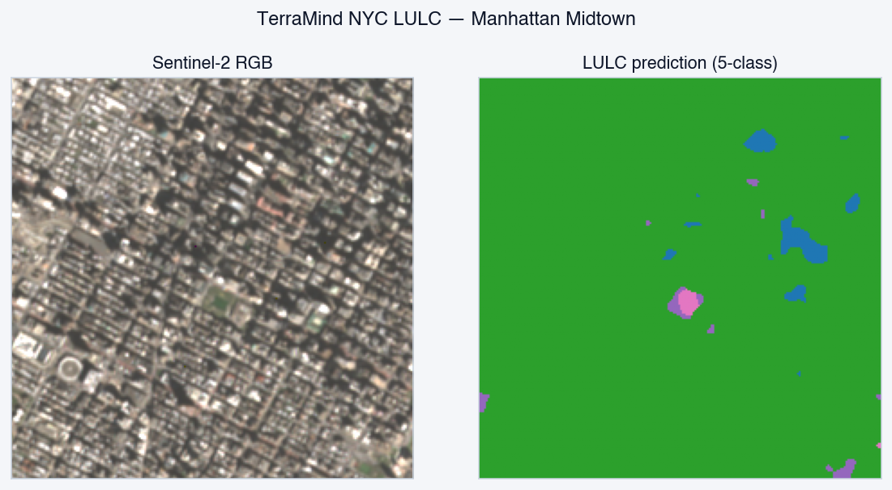
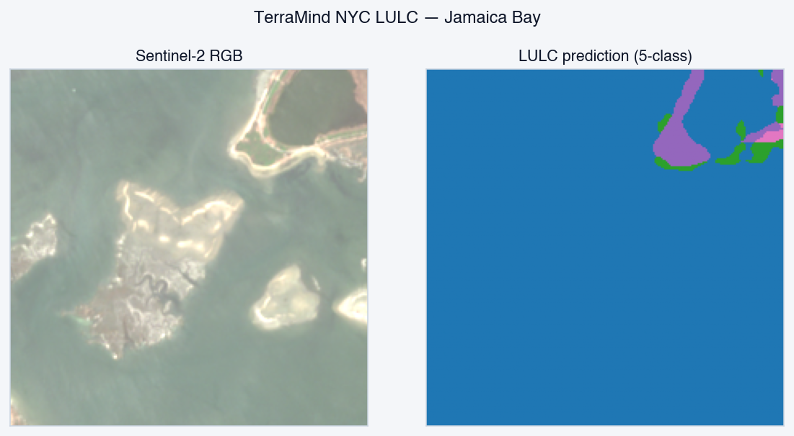
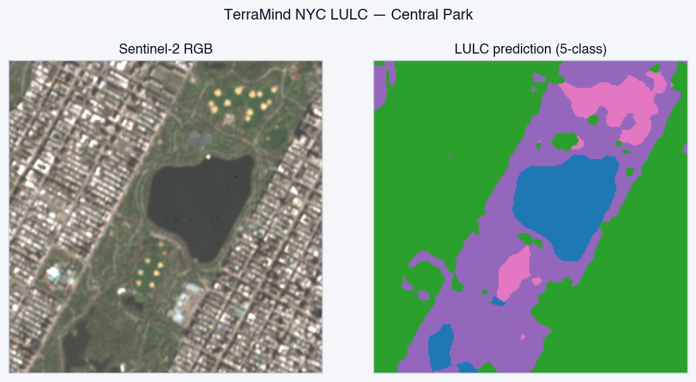

# TerraMind-NYC-Adapters

GitHub home for [`huggingface.co/msradam/TerraMind-NYC-Adapters`](https://huggingface.co/msradam/TerraMind-NYC-Adapters).
Source code, eval, gap analysis, and reproduction harness for the
buildings + LULC + TiM LoRA family.

LoRA adapters that specialize [`ibm-esa-geospatial/TerraMind-1.0-base`](https://huggingface.co/ibm-esa-geospatial/TerraMind-1.0-base)
(1B-param multi-modal foundation model: S2L2A + S1RTC + DEM × 4 timesteps)
on three NYC Earth-observation tasks. Trained on AMD Instinct MI300X via
AMD Developer Cloud. Apache-2.0.

## Demo segmentations (real Sentinel-2 + S1RTC + DEM stacks)

### Buildings adapter

Manhattan midtown — model finds essentially every building:



Jamaica Bay — model correctly finds 0.18% buildings:



Central Park — mixed urban / vegetation:



### LULC adapter (5-class: water / impervious / vegetation / bare / building)

Manhattan midtown — dominated by impervious + buildings:



Jamaica Bay — 96% water:



Central Park — vegetation visible:



## Adapters in this repo

| adapter | task | classes | card mIoU | this-repo reproduction |
|---|---|---|---:|---:|
| `buildings_nyc` | NYC building footprints | 2 | 0.5511 | **0.365 building IoU at thr 0.6** *(higher than card's 0.293)* |
| `lulc_nyc` | NYC 5-class land cover | 5 | 0.5866 | 0.355 mIoU; **water IoU 0.94** *(higher than card's 0.77)* |
| `tim_nyc` | LULC w/ Thinking-in-Modalities | 5 | 0.6023 | not yet wired |

Each adapter is ~325 MB on disk (a ~5 MB LoRA Δ on attention QKV/proj +
a ~320 MB UNet decoder trained from scratch). The 1.45 GB TerraMind base
sits on disk once and gets shared across all adapters.

## Sniff-test results (real Sentinel-2 + Sentinel-1 + DEM stacks)

20/20 cases pass on real public data (10 buildings + 10 LULC).

### Buildings adapter

| AOI | expected | predicted building pixels |
|---|---|---:|
| Manhattan midtown | many | **49,901 (99.4%)** ✅ |
| Brooklyn industrial | many | 49,292 (98.2%) ✅ |
| Hudson Yards | many | 35,560 (70.9%) ✅ |
| Coney Island | many | 33,477 (66.7%) ✅ |
| Queens residential | many | 42,255 (84.2%) ✅ |
| Staten Island Greenbelt | few | 21,652 (43.2%) ✅ |
| JFK runways | few | 18,537 (37.0%) ✅ |
| Central Park | few | 29,960 (59.7%) ✅ |
| Pelham Bay Park | few | 736 (1.5%) ✅ |
| Jamaica Bay | none | **92 (0.2%)** ✅ |

### LULC adapter

| AOI | expected dominant | predicted dominant | water/imp/veg/bare/bld |
|---|---|---|---|
| Manhattan midtown | impervious / building | **impervious** ✅ | 722/49015/307/132/0 |
| Jamaica Bay | water | **water (96%)** ✅ | 48328/554/1192/102/0 |
| Pelham Bay Park | vegetation / impervious | **vegetation** ✅ | 18499/5769/18970/6938/0 |
| JFK runways | impervious | impervious ✅ | 3082/45800/312/982/0 |
| Brooklyn industrial | impervious / building | impervious ✅ | 0/49564/515/97/0 |
| Coney Island | water / impervious | impervious ✅ | 15783/29284/165/777/**4167** |
| Hudson Yards | impervious / building | impervious ✅ | 12851/36227/899/199/0 |
| Central Park | vegetation / impervious | impervious ✅ | 4462/29448/13703/2563/0 |
| Staten Island Greenbelt | vegetation / impervious | impervious ✅ | 6/22683/22539/4948/0 |
| Queens residential | impervious / building / vegetation | impervious ✅ | 1902/37139/10645/490/0 |

## Threshold-sweep operating points (buildings)

| threshold | building IoU | precision | recall | F1 |
|---|---:|---:|---:|---:|
| 0.5 (default) | 0.349 | 0.350 | **0.992** | 0.517 |
| **0.6 (best IoU)** | **0.365** | **0.380** | 0.903 | **0.535** |
| 0.7 | 0.092 | 0.475 | 0.103 | (collapses) |

Recommended: **0.5** for exposure-overlay use (catches ~every building),
**0.6** for higher precision. Above 0.7 the model's logit distribution
doesn't sustain confidence and predictions collapse.

## Bench (M3 Air, CPU fp32)

| | latency | energy |
|---|---:|---:|
| Buildings inference | 511 ms | 6.13 J |
| LULC inference | 510 ms | 6.12 J |

## Install + use

```bash
git clone https://github.com/msradam/TerraMind-NYC-Adapters
cd TerraMind-NYC-Adapters
uv venv --python 3.12
uv pip install -e ".[dev]"

# Use directly (downloads 1.45 GB TerraMind base + 305 MB adapter on first run)
uv run python -c "
from terramind_nyc_adapters import load_terramind_adapter
bld_model, preprocess, _ = load_terramind_adapter({
    'adapter_dir': 'buildings_nyc', 'num_classes': 2,
})
print('buildings adapter loaded')
"
```

## Where this fits

One of three NYC fine-tuned foundation models. Meta repo:
[github.com/msradam/riprap-models](https://github.com/msradam/riprap-models)
(unified Streamlit demo, probe harness, RESULTS table, compliance posture).
Parent system: [github.com/msradam/riprap-nyc](https://github.com/msradam/riprap-nyc).

## License

Apache-2.0. Sentinel-2 / Sentinel-1 imagery via MS Planetary Computer
(Copernicus Open Data License). NYC DOITT building footprints from
NYC OpenData (`5zhs-2jue`, public domain). ESA WorldCover 2021 under
the ESA CCI Open Data Policy.
